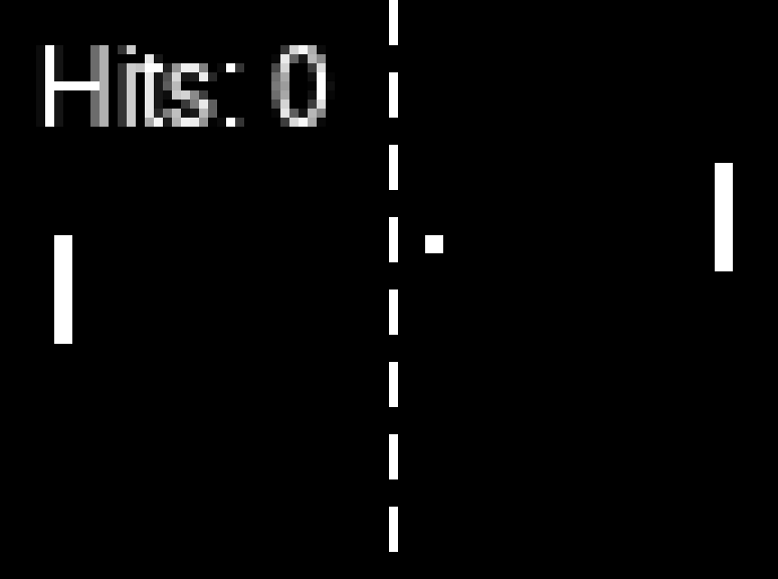
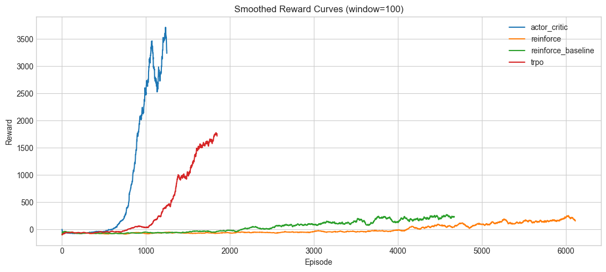
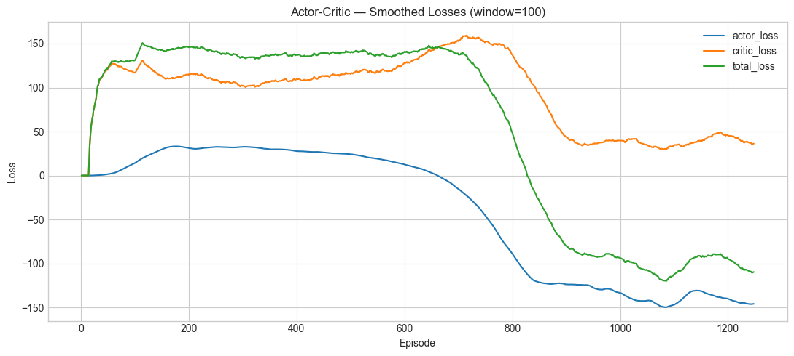
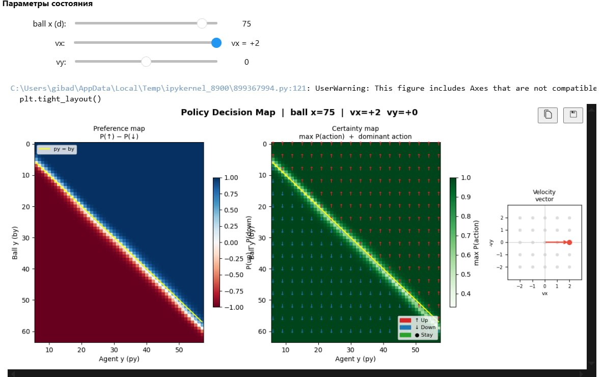
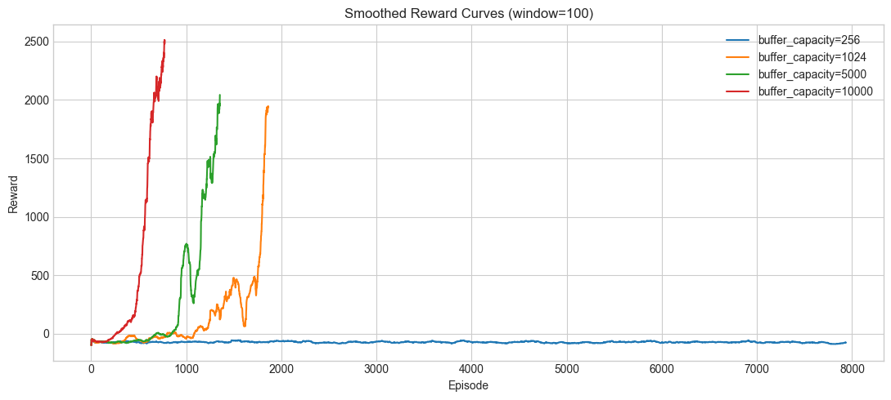
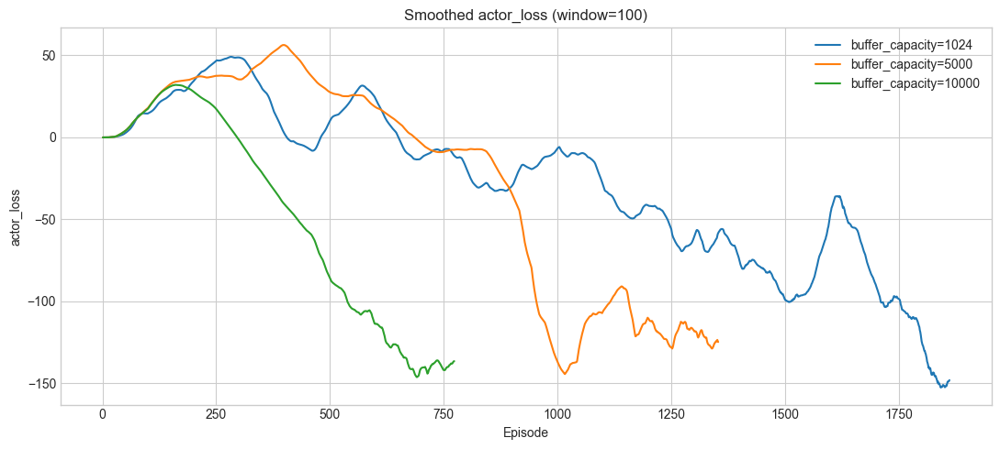
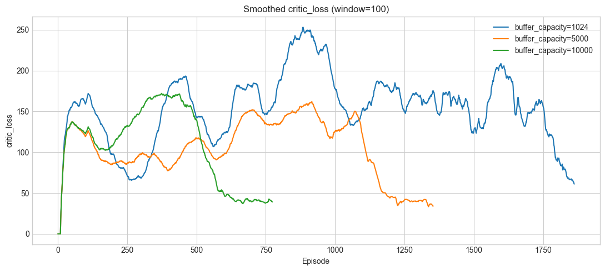
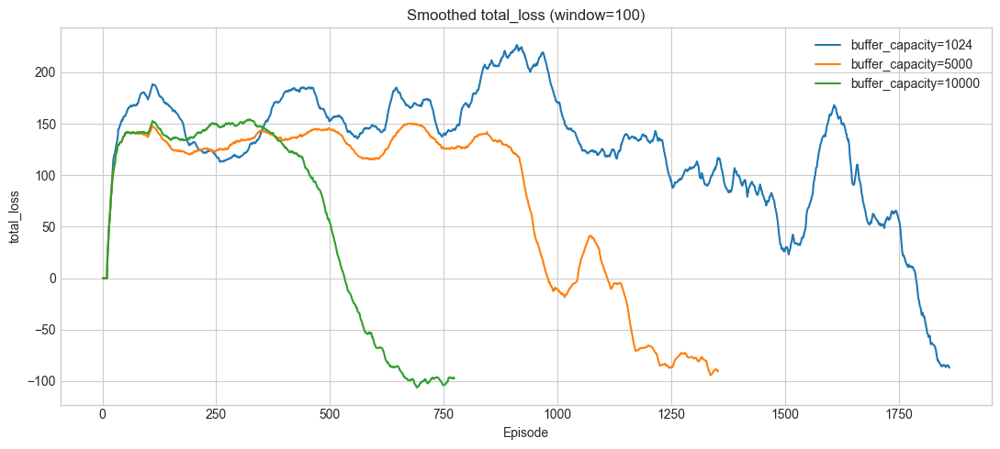
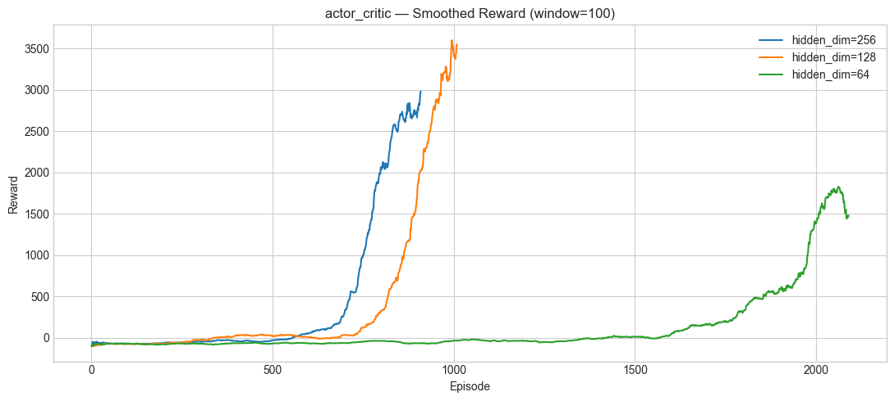
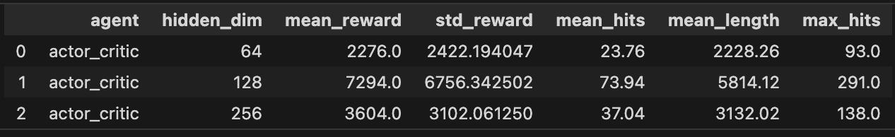

# Horizontal Pong — Policy Gradient Methods

## 1. Task Description

**Horizontal Pong** is a discrete, episodic 2D Pong environment in which an RL agent controls the **right paddle** and must deflect a ball as many times as possible against a rule-based opponent on the left. The environment is implemented from scratch (no Gymnasium dependency) with integer-valued physics, swept collision detection, and a configurable opponent curriculum.

<p align="center">
  
</p>
<p align="center">
  <em>Example gameplay of the trained Actor-Critic agent (right paddle) against the rule-based opponent (left paddle).</em>
</p>

### State Space

The observation is a normalized real-valued vector of 5 components:

$$s = \left(\frac{b_x}{W},\ \frac{b_y}{H},\ \frac{v_x}{v_x^{\max}},\ \frac{v_y}{v_y^{\max}},\ \frac{p_y}{H}\right) \in [0,1]^2 \times [-1,1]^2 \times [0,1]$$

| Component | Raw range | Description |
|-----------|-----------|-------------|
| $b_x$ | $0 \ldots W{-}1$ | Ball horizontal position |
| $b_y$ | $0 \ldots H{-}1$ | Ball vertical position |
| $v_x$ | $-v_x^{\max} \ldots -1,\ +1 \ldots v_x^{\max}$ | Ball horizontal velocity (never zero) |
| $v_y$ | $-v_y^{\max} \ldots +v_y^{\max}$ | Ball vertical velocity |
| $p_y$ | $\text{PH}/2 \ldots H{-}1{-}\text{PH}/2$ | Agent paddle vertical center |

Default dimensions: $W = 86$, $H = 64$, $\text{PH} = 12$, $v_x^{\max} = 4$, $v_y^{\max} = 4$.

### Action Space

$$\mathcal{A} = \lbrace 0,\ 1,\ 2 \rbrace$$

| Code | Action | Effect |
|------|--------|--------|
| 0 | Up | $p_y \leftarrow p_y - \text{speed}$, clamped at $\text{PH}/2$ |
| 1 | Down | $p_y \leftarrow p_y + \text{speed}$, clamped at $H{-}1{-}\text{PH}/2$ |
| 2 | Stay | No change |

### Transition Function

The environment is **deterministic**. We write the transition mapping as:

$$s_{t+1} = T(s_t, a_t)$$

In this implementation, the only branching is due to the discrete action $a_t \in \lbrace 0,1,2 \rbrace$ (up / down / stay). The paddle update inside $T$ is:

$$p_y' = \begin{cases}
\max(p_y - \text{speed},\ \text{PH}/2) & a_t = 0 \\\\
\min(p_y + \text{speed},\ H{-}1{-}\text{PH}/2) & a_t = 1 \\\\
p_y & a_t = 2
\end{cases}$$

After this action-dependent paddle update, all remaining parts of $T$ are deterministic physics (ball advance, wall bounce, swept paddle collisions, and parabolic deflection).  
In short: **deterministic core dynamics + optional stochastic bounce noise**.

1. **Paddle update**: agent paddle moves according to the selected action, clamped to valid vertical range.
2. **Ball advance**: $b_x \leftarrow b_x + v_x$, $b_y \leftarrow b_y + v_y$.
3. **Wall bounce**: if $b_y \leq 0$ or $b_y \geq H{-}1$, the vertical velocity reverses ($v_y \leftarrow -v_y$) and $b_y$ is clamped.
4. **Agent paddle hit**: swept collision detects whether the ball crossed the paddle x-line $x_R$ during this step. On hit, $v_x \leftarrow -|v_x|$ and parabolic angular deflection is applied (see below).
5. **Opponent paddle hit**: the left paddle (controlled by a rule-based AI) intercepts the ball and applies curriculum-controlled bounce noise.

**Parabolic paddle deflection.** When the ball hits a paddle, the vertical velocity receives a quadratic boost depending on where on the paddle face the impact occurred. Let $\Delta = b_y - p_y$ be the signed offset from the paddle center, and $h = \lfloor \text{PH}/2 \rfloor$. The normalized impact parameter is:

$$t = \text{clip}\left(\frac{\Delta}{h},\ -1,\ 1\right)$$

The boost added to $v_y$ is:

$$\Delta v_y = t \cdot |t| \cdot v_y^{\max}$$

Center hits produce near-zero deflection while edge hits produce maximum deflection, with a smooth quadratic profile in between. The incoming $v_y$ is preserved and the boost is additive:

$$v_y \leftarrow \text{clip}\left(\text{round}(v_y + \Delta v_y),\ -v_y^{\max},\ v_y^{\max}\right)$$

**Stochastic bounce noise.** After each paddle hit, with probability $p_{\text{bounce}}$ (default 0.1), an additional random perturbation $\delta \sim \text{Uniform}(-1, 0, +1)$ is added to $v_y$. This makes the transitions stochastic even without opponent noise.

### Opponent

The left paddle is controlled by a `LeftPaddleOpponent` that uses **predictive interception**: when the ball moves toward it ($v_x < 0$), the opponent simulates the ball trajectory forward (including wall bounces) to predict the intercept $y$-coordinate at the paddle line, then moves toward that $y$ at `paddle_speed`. When the ball moves away, the opponent drifts toward field center.

The opponent adds integer noise $\delta \sim \text{Uniform}(-\sigma \ldots +\sigma)$ to $v_y$ upon deflection, where $\sigma$ is a fixed parameter (default $\sigma = 0$, i.e. no noise).

### Episode Termination

| Condition | Type | Meaning |
|-----------|------|---------|
| $b_x \geq W$ | Terminated | Ball passed the agent (agent loses the rally) |
| $b_x < 0$ | Terminated | Ball passed the opponent (agent wins the rally) |
| $t \geq T_{\max}$ | Truncated | Time limit reached (default $T_{\max} = 5000$) |

### Reward Function

$$r(s, a) = \begin{cases} +100 & \text{if agent paddle deflects the ball} \\\\ -100 & \text{if ball exits on the agent side } (b_x \geq W) \\\\ 0 & \text{otherwise} \end{cases}$$

**Optional dense reward shaping** (active when $v_x > 0$, i.e. ball approaching agent):

$$r_{\text{dense}} = -\alpha \cdot \frac{|p_y - b_y|}{H}$$

where $\alpha$ decays linearly from $\alpha_0 = 0.01$ to $0$ over the first $100\text{k}$ global steps. This encourages the paddle to track the ball early in training, then fades to let the agent optimize the true sparse objective.

---

## 2. Algorithms

We implement and compare four policy gradient methods. All share the same observation/action interface. The on-policy agents (REINFORCE, REINFORCE-Baseline, TRPO) use an identical two-layer MLP policy:

$$\text{state}\ (5) \to \text{Linear}(256) \to \text{ReLU} \to \text{Linear}(256) \to \text{ReLU} \to \text{Linear}(3) \to \text{logits}$$

### 2.1 REINFORCE

The simplest Monte Carlo policy gradient method. After collecting a batch of $K = 10$ complete episodes, the agent computes discounted returns $G_t = \sum_{k=0}^{T-t-1} \gamma^k r_{t+k}$ and performs one gradient step:

$$\nabla_\theta J(\theta) = \frac{1}{|\mathcal{B}|}\sum_{(s_t, a_t, G_t) \in \mathcal{B}} \nabla_\theta \log \pi_\theta(a_t | s_t) \cdot \hat{G}_t$$

where $\hat{G}_t = G_t / (\text{std}(G) + \varepsilon)$ is std-normalized (**no baseline** — no mean subtraction). An entropy bonus with coefficient $\beta = 0.01$ encourages exploration. Gradients are clipped to norm $1.0$.

### 2.2 REINFORCE with Baseline

Identical to REINFORCE but subtracts an **exponential moving average (EMA)** of episode returns as a heuristic baseline:

$$b \leftarrow 0.99 \cdot b + 0.01 \cdot \bar{G}_{\text{episode}}$$

The advantage $A_t = G_t - b$ replaces $G_t$ in the policy gradient, followed by std-normalization. This reduces variance without introducing a learned value function. The baseline scalar is persisted across checkpoints.

### 2.3 TRPO

Trust Region Policy Optimization constrains each policy update to stay within a KL divergence trust region, preventing catastrophically large steps. Our implementation uses **no value network** — advantages are computed from normalized Monte Carlo returns (mean-subtracted, std-normalized).

The update follows the standard TRPO procedure:

1. Compute the **surrogate objective** with importance sampling ratio and entropy bonus:

$$L(\theta) = \hat{\mathbb{E}}\left[\frac{\pi_\theta(a|s)}{\pi_{\theta_{\text{old}}}(a|s)} \hat{A}(s,a)\right] + \beta \cdot H(\pi_\theta)$$

2. Compute the **policy gradient** $g = \nabla_\theta L(\theta)$, clipped to norm $\leq 3.0$.

3. Find the **natural gradient direction** via the **conjugate gradient** algorithm (10 iterations) on the Fisher information matrix, with damping $0.05$:

$$Fd = -g, \quad \text{then scale } d \text{ so that } \tfrac{1}{2} d^T F d = \delta_{\text{KL}}$$

4. **Line search** with backtracking (up to 10 steps, factor $0.8$) to ensure $\text{KL}(\pi_{\theta_{\text{old}}} \| \pi_\theta) \leq \delta_{\text{KL}}$ and the surrogate improves. Default trust region size: $\delta_{\text{KL}} = 0.001$.

### 2.4 Actor-Critic (Off-Policy, Shared Backbone)

The **Actor-Critic** is the primary agent studied in this project. Unlike the on-policy methods above, it learns off-policy from a replay buffer, enabling more sample-efficient use of experience.

#### Architecture

The agent uses a **single shared MLP backbone** with two separate linear heads — one for action logits (actor) and one for per-action Q-values (critic):

$$\text{state}\ (5) \to \underbrace{\text{Linear}(256) \to \text{ReLU} \to \text{Linear}(256) \to \text{ReLU}}_{\text{shared backbone}} \to \phi(s)$$

$$\phi(s) \to \text{Actor head: Linear}(3) \to \text{logits } \in \mathbb{R}^{|\mathcal{A}|}$$

$$\phi(s) \to \text{Critic head: Linear}(3) \to Q(s, \cdot) \in \mathbb{R}^{|\mathcal{A}|}$$

The shared backbone forces the actor and critic to develop a common state representation, which improves gradient flow and makes learning more stable. Orthogonal initialization is applied: the backbone uses gain $\sqrt{2}$, the actor head uses gain $0.01$ (near-uniform initial policy), and the critic head uses gain $1.0$.

#### Off-Policy Learning Pipeline

Transitions $(s, a, r, s', \text{done})$ are stored in a **circular replay buffer** of capacity $M$. Every $U$ environment steps, a mini-batch of $B$ transitions is sampled uniformly for a single gradient step. This decouples data collection from learning: each transition can be reused many times, which is particularly beneficial in environments with long episodes.

#### Critic Loss (Expected-SARSA TD Target)

The critic learns $Q(s, a)$ via one-step TD error. The target uses the current policy probabilities to compute the expected next-state value:

$$V^{\pi}(s') = \sum_{a'} \pi(a' | s') \cdot Q(s', a')$$

$$L_{\text{critic}} = \frac{1}{B}\sum_{i=1}^{B}\left(Q(s_i, a_i) - \left[r_i + \gamma (1 - d_i) \cdot V^{\pi}(s_i')\right]\right)^2$$

This is the Expected-SARSA formulation: instead of bootstrapping from $Q(s', a')$ for a single sampled $a'$, we take an expectation over all actions under the current policy. This reduces variance compared to standard SARSA while maintaining an on-policy target for the critic.

#### Actor Loss (Analytical Policy Gradient)

The actor is updated via a **fully differentiable analytical** policy gradient, directly maximizing the expected Q-value under the current policy:

$$L_{\text{actor}} = -\frac{1}{B}\sum_{i=1}^{B} \sum_{a} \pi(a | s_i) \cdot Q(s_i, a)$$

where Q-values are **detached** (treated as constants) so that gradients flow only through the policy probabilities $\pi(a|s)$. This avoids the high variance of log-probability-based policy gradients (like REINFORCE) by directly differentiating through the softmax action distribution.

#### Entropy Regularization

An entropy bonus prevents premature policy collapse to a deterministic policy:

$$L_{\text{entropy}} = \frac{1}{B}\sum_{i=1}^{B} \sum_a \pi(a | s_i) \log \pi(a | s_i)$$

Minimizing $L_{\text{entropy}}$ (which is negative entropy) encourages the policy to maintain stochasticity, especially in early training when the Q-function is still inaccurate.

#### Combined Loss

All three loss components are optimized jointly by a single Adam optimizer on the shared network:

$$L = c_{\text{critic}} \cdot L_{\text{critic}} + L_{\text{actor}} + c_{\text{entropy}} \cdot L_{\text{entropy}}$$

with default coefficients $c_{\text{critic}} = 1.0$ and $c_{\text{entropy}} = 0.1$. Global gradient clipping (max norm $1.0$) is applied before the optimizer step.

#### Learning Rate Schedule

The learning rate follows a **cosine decay** from $\text{lr}_{\max}$ to $\text{lr}_{\min}$, with an optional linear warmup phase:

$$\text{lr}(t) = \begin{cases} \text{lr}_{\min} + (\text{lr}_{\max} - \text{lr}_{\min}) \cdot \frac{t}{T_{\text{warmup}}} & \text{if } t < T_{\text{warmup}} \\\\ \text{lr}_{\min} + \frac{1}{2}(\text{lr}_{\max} - \text{lr}_{\min})\left(1 + \cos\left(\pi \cdot \frac{t - T_{\text{warmup}}}{T_{\text{decay}} - T_{\text{warmup}}}\right)\right) & \text{otherwise} \end{cases}$$

This prevents late-training instability by gradually reducing the step size as the policy approaches convergence.

### 2.5 Hyperparameters (Documented Defaults)

Main defaults used in experiments (from `run/config.py`):

| Group | Parameter | Default |
|------|-----------|---------|
| Environment | `width`, `height` | `86`, `64` |
| Environment | `paddle_height`, `paddle_speed` | `12`, `3` |
| Environment | `max_ball_speed_x`, `max_ball_speed_y` | `4`, `4` |
| Environment | `t_max` | `5000` |
| Training | `total_steps` | `500000` |
| Training | `seed`, `device` | `42`, `cpu` |
| Actor-Critic | `hidden_dim`, `gamma` | `256`, `0.99` |
| Actor-Critic | `lr`, `lr_min` | `3e-4`, `3e-5` |
| Actor-Critic | `buffer_capacity`, `batch_size`, `update_every` | `50000`, `1000`, `10` |
| Actor-Critic | `critic_coeff`, `entropy_coeff`, `grad_clip_norm` | `1.0`, `0.1`, `1.0` |
| REINFORCE | `hidden_dim`, `gamma`, `lr_actor` | `256`, `0.99`, `3e-4` |
| REINFORCE-Baseline | `hidden_dim`, `gamma`, `lr_actor` | `256`, `0.99`, `3e-4` |
| TRPO | `hidden_dim`, `gamma` | `256`, `0.99` |
| TRPO | `max_kl`, `damping`, `cg_iters` | `0.001`, `0.05`, `10` |
| TRPO | `backtrack_iters`, `backtrack_coeff`, `grad_clip_norm` | `10`, `0.8`, `3.0` |

---

## 3. Training Results

### 3.1 Learning Curves — All Agents

<p align="center">
  
</p>
<p align="center">
  <em>Mean episode reward (smoothed) as a function of training episode for all four agents.</em>
</p>

**Plot description:**
Actor-Critic (off-policy) dominates all other methods, reaching a mean reward of $\approx 3200$ within $\sim 1200$ episodes and sustaining $\approx 33$ hits per episode. TRPO is the second-best agent with $\approx 1700$ reward and $\approx 17$ hits, showing stable monotonic improvement thanks to the trust-region constraint. Both REINFORCE variants remain near-zero reward throughout training: vanilla REINFORCE converges to $\approx 155$ ($\approx 2.5$ hits) and REINFORCE with Baseline to $\approx 232$ ($\approx 3.3$ hits). The EMA baseline provides only marginal variance reduction, insufficient to overcome the high-variance Monte Carlo gradient in this sparse-reward environment.

### 3.2 Actor-Critic Loss Dynamics

<p align="center">
  
</p>
<p align="center">
  <em>Actor-Critic training dynamics: critic loss, actor loss, and total loss as functions of training episode.</em>
</p>

**Plot description:**
The critic loss (TD error) spikes early as the Q-function bootstraps from random values, then gradually decreases as the critic converges. The actor loss (negative expected Q-value) trends downward over training, reflecting that the policy learns to select actions with increasingly high Q-values. The total loss combines both components and mirrors the critic loss profile, since the critic term dominates the combined objective.

### 3.3 Actor-Critic Policy Visualization

<p align="center">
  
</p>
<p align="center">
  <em>Policy decision map for the trained Actor-Critic agent. Each cell shows the preferred action (up/down/stay) as a function of agent paddle position (y-axis) and ball position (x-axis), for a fixed ball velocity. The map reveals the learned interception strategy: the agent moves toward the ball when it is approaching and stays otherwise.</em>
</p>

**Plot description:**
The heatmap visualizes the greedy policy $\arg\max_a \pi(a \mid s)$ across a grid of (ball $y$, paddle $y$) positions for a fixed ball velocity directed toward the agent. Above the diagonal (paddle below the ball) the agent predominantly selects "Up"; below the diagonal (paddle above the ball) it selects "Down"; near the diagonal (paddle aligned with the ball) it selects "Stay". This confirms that the learned policy implements a sensible interception strategy — track the ball vertically and hold position once aligned.

---

## 4. Ablation Studies

### 4.1 Replay Buffer Capacity

The replay buffer capacity $M$ is a critical hyperparameter for the off-policy Actor-Critic. A buffer that is too small may lead to overfitting on recent experience and correlated batches, while an excessively large buffer dilutes fresh high-reward transitions with stale data from an outdated policy. We sweep over $M \in \lbrace 1024,\ 5000,\ 10000 \rbrace$ with all other hyperparameters fixed.

<p align="center">
  
</p>
<p align="center">
  <em>Mean episode reward over training for different replay buffer capacities.</em>
</p>

**Plot description:**
All three buffer sizes learn successfully. $M = 10000$ achieves the best final performance ($\approx 2500$ reward), while $M = 5000$ is close behind ($\approx 2000$). $M = 1024$ converges to slightly lower reward ($\approx 1950$). Larger buffers decorrelate mini-batches and improve training stability, but can slightly slow early-phase learning by mixing fresh transitions with older experience.

<p align="center">
  
</p>
<p align="center">
  <em>Actor loss dynamics for different buffer capacities.</em>
</p>

**Plot description:**
The actor loss curves differ in stability across capacities: larger buffers generally yield smoother trajectories due to less correlated mini-batches. Since the Actor-Critic actor objective directly depends on the critic's Q estimates, instability in the critic typically propagates to the actor as higher-variance updates.

<p align="center">
  
</p>
<p align="center">
  <em>Critic loss (TD error) dynamics for different buffer capacities.</em>
</p>

**Plot description:**
The critic loss is noticeably smoother for larger buffer capacities, consistent with improved sample diversity and reduced temporal correlation in mini-batches. Smaller buffers tend to produce noisier TD targets and higher-variance gradients, which manifests as a more oscillatory critic loss.

<p align="center">
  
</p>
<p align="center">
  <em>Total loss dynamics for different buffer capacities.</em>
</p>

**Plot description:**
The total loss largely tracks the critic loss because the critic MSE term dominates the joint objective. As buffer capacity increases, the total loss becomes smoother, indicating more stable optimization.

### 4.2 Hidden Dimension (256 vs 128 vs 64) — Actor-Critic

To study model capacity, we run **Actor-Critic only** with three MLP hidden sizes: $h \in \lbrace 256,\ 128,\ 64 \rbrace$, keeping all other hyperparameters unchanged.

<p align="center">
  
</p>
<p align="center">
  <em>Reward learning curves for Actor-Critic under hidden dimensions 256, 128, and 64.</em>
</p>

**Plot description:**
This ablation measures how reducing representational capacity affects learning speed and final policy quality for Actor-Critic. In general, larger hidden dimensions are expected to improve stability and asymptotic performance, while smaller models may underfit the ball–paddle interaction dynamics and learn more slowly.

<p align="center">
  
</p>
<p align="center">
  <em>Deterministic evaluation metrics comparing hidden dimensions 256 vs 128 vs 64 for Actor-Critic.</em>
</p>

**Table description:**
This table summarizes the evaluation performance of the trained checkpoints under a deterministic (argmax) policy. It complements the learning curves by showing the final policy quality for each agent and hidden dimension under the same evaluation conditions.

---

## 5. Model Tournament

*Section reserved for future tournament evaluation across trained agents. Results will be added after completion.*

---

## 6. Summary

This project compared four policy gradient methods on the Horizontal Pong environment. The key findings are:

1. **Actor-Critic is the clear winner.** The off-policy Actor-Critic agent with a shared backbone achieves an average reward of $\approx 3200$ and sustains rallies of $\approx 33$ hits per episode, far surpassing all other methods. Its ability to reuse experience through a replay buffer makes it dramatically more sample-efficient — it reaches high performance within $\sim 1200$ episodes, while the on-policy methods require thousands more episodes yet converge to much lower scores.

2. **TRPO is a solid second.** Trust Region Policy Optimization reaches $\approx 1700$ reward and $\approx 17$ hits per episode. The constrained policy updates prevent catastrophic collapses, producing stable, monotonic improvement. However, its on-policy nature limits sample efficiency compared to Actor-Critic.

3. **Vanilla REINFORCE methods struggle.** Both REINFORCE ($\approx 155$ reward, $\approx 2.5$ hits) and REINFORCE with Baseline ($\approx 232$ reward, $\approx 3.3$ hits) converge to weak policies. The EMA baseline provides a modest variance reduction but is insufficient to overcome the fundamental high-variance problem of Monte Carlo policy gradients in this environment with sparse $\pm 100$ rewards.

4. **Replay buffer capacity is critical for Actor-Critic.** In the sweep over $M \in \lbrace 1024,\ 5000,\ 10000 \rbrace$, all runs learn functional policies. $M = 10000$ achieves the best final performance ($\approx 2500$ reward, $\approx 26$ hits), while $M = 5000$ is close ($\approx 2000$ reward, $\approx 21$ hits) and $M = 1024$ converges slightly lower ($\approx 1950$ reward, $\approx 20$ hits). Larger buffers decorrelate mini-batches and improve training stability, but can slightly slow early-phase learning by mixing fresh transitions with older experience.

5. **Off-policy learning with analytical gradients is the key advantage.** The Actor-Critic's analytical policy gradient (directly differentiating $\sum_a \pi(a|s) \cdot Q(s,a)$) avoids the high variance of log-probability-based estimators used in REINFORCE. Combined with the Expected-SARSA critic and entropy regularization, this yields stable, efficient learning even with a simple two-layer MLP architecture.

---

## 7. Repository Structure

```
HorizontalPong/
├── README.md                          # This file
├── requirements.txt                   # Python dependencies
├── .gitignore
│
├── src/                               # Core source code
│   ├── __init__.py
│   ├── environment/
│   │   ├── __init__.py
│   │   ├── pong_env.py                # PongEnv: reset, step, seed, reward, transitions
│   │   ├── opponent.py                # LeftPaddleOpponent: predictive AI + curriculum
│   │   └── renderer.py               # PongRenderer: Pygame display, frame capture, GIF export
│   └── agent/
│       ├── __init__.py
│       ├── networks.py                # ActorNetwork, ActorCriticNetwork (shared backbone)
│       ├── actor_critic.py            # ActorCriticAgent: off-policy, Expected-SARSA critic
│       ├── reinforce.py               # ReinforceAgent: Monte Carlo policy gradient
│       ├── reinforce_baseline.py      # ReinforceBaselineAgent: REINFORCE + EMA baseline
│       ├── trpo.py                    # TRPOAgent: trust region with CG and line search
│       └── replay_buffer.py           # ReplayBuffer: circular (s, a, r, s', done) storage
│
├── run/                               # Training, evaluation, and manual play scripts
│   ├── __init__.py
│   ├── config.py                      # All hyperparameter dataclasses
│   ├── train.py                       # Training entry point (CLI)
│   ├── eval.py                        # Evaluation: metrics, live rendering, GIF recording
│   └── play.py                        # Human keyboard play against the opponent
│
├── analysis/                          # Jupyter notebooks for visualization
│   ├── learning_curves.ipynb          # Compare all agents: reward, hits, losses
│   ├── policy_decision_map.ipynb      # Interactive AC policy heatmaps (ipywidgets)
│   ├── buffer_capacity_compare.ipynb  # Sweep AC buffer capacity + training runs
│   └── hidden_dim_compare.ipynb       # Sweep hidden_dim (256/128/64) for Actor-Critic
│
└── artifacts/                         # Model checkpoints, training logs, GIFs
    ├── .gitkeep
    ├── checkpoints/                   # Intermediate step_*.pt snapshots
    └── buffer_capacity_sweep/         # Per-capacity training outputs
```
