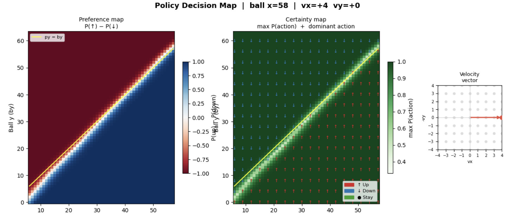

# Horizontal Pong — Policy Gradient Methods

## 1. Task Description

**Horizontal Pong** is a discrete, episodic 2D Pong environment in which an RL agent controls the **right paddle** and must deflect a ball as many times as possible against a **fixed heuristic opponent** on the left (hand-written rules, not a learned policy). The environment is implemented from scratch (no Gymnasium dependency) with integer-valued physics and swept collision detection.

<p align="center">
  
</p>
<p align="center">
  <em>Example gameplay of the trained Actor-Critic agent (right paddle) against the heuristic opponent (left paddle).</em>
</p>

### State Space

The observation is a normalized real-valued vector of 5 components:

$$s = \left(\frac{b_x}{W},\ \frac{b_y}{H},\ \frac{v_x}{v_x^{\max}},\ \frac{v_y}{v_y^{\max}},\ \frac{p_y}{H}\right) \in [0,1]^2 \times [-1,1]^2 \times [0,1]$$

| Component | Raw range | Description |
|-----------|-----------|-------------|
| $b_x$ | $0 \ldots W{-}1$ | Ball horizontal position |
| $b_y$ | $0 \ldots H{-}1$ | Ball vertical position |
| $v_x$ | $-v_x^{\max} \ldots -1,\ +1 \ldots v_x^{\max}$ | Ball horizontal velocity (never zero) |
| $v_y$ | $-v_y^{\max} \ldots +v_y^{\max}$ | Ball vertical velocity |
| $p_y$ | $\text{PH}/2 \ldots H{-}1{-}\text{PH}/2$ | Agent paddle vertical center |

Here $\text{PH}$ is the full paddle height (in pixels).  
Default dimensions: $W = 86$, $H = 64$, $\text{PH} = 12$, $v_x^{\max} = 2$, $v_y^{\max} = 2$.

### Action Space

$$\mathcal{A} = \lbrace 0,\ 1,\ 2 \rbrace$$

| Code | Action | Effect |
|------|--------|--------|
| 0 | Up | $p_y \leftarrow p_y - \text{speed}$, clamped at $\text{PH}/2$ |
| 1 | Down | $p_y \leftarrow p_y + \text{speed}$, clamped at $H{-}1{-}\text{PH}/2$ |
| 2 | Stay | No change |

Default movement/velocity parameters used in the current config:
- `paddle_speed = 2` (this is `speed` in the action update above)
- `max_ball_speed_x = 2`
- `max_ball_speed_y = 2`

### Transition Function

The transition is represented as a conditional distribution:

$$P(s_{t+1}\mid S_t, A_t)$$

The paddle-update component is:

$$p_y' = \begin{cases}
\max(p_y - \text{speed},\ \text{PH}/2) & a_t = 0 \\\\
\min(p_y + \text{speed},\ H{-}1{-}\text{PH}/2) & a_t = 1 \\\\
p_y & a_t = 2
\end{cases}$$

where $p_y$ is the current agent paddle center and $p_y'$ is the next-step paddle center after applying action $a_t$.

After this action-dependent paddle update, the ball and collision dynamics follow the environment physics.
However, the full transition is **not deterministic** because random bounce perturbations can modify $v_y$ stochastically on paddle contacts.

1. **Paddle update**: agent paddle moves according to the selected action, clamped to valid vertical range.
2. **Ball advance**: $b_x \leftarrow b_x + v_x$, $b_y \leftarrow b_y + v_y$.
3. **Wall bounce**: if $b_y \leq 0$ or $b_y \geq H{-}1$, the vertical velocity reverses ($v_y \leftarrow -v_y$) and $b_y$ is clamped.
4. **Agent paddle hit**: swept collision detects whether the ball crossed the paddle x-line $x_R$ during this step. On hit, $v_x \leftarrow -|v_x|$ and parabolic angular deflection is applied (see below).
5. **Opponent paddle hit**: the left paddle follows a **hand-crafted heuristic** (predictive interception; see below), not a learned model. On deflection it may apply optional integer bounce noise controlled by $\sigma$ (default $0$).


**Parabolic paddle deflection.** When the ball hits a paddle, the vertical velocity receives a quadratic boost depending on where on the paddle face the impact occurred. Let $\Delta = b_y - p_y$ be the signed offset from the paddle center, and $h = \lfloor \text{PH}/2 \rfloor$. The normalized impact parameter is:

$$t = \text{clip}\left(\frac{\Delta}{h},\ -1,\ 1\right)$$

The boost added to $v_y$ is:

$$\Delta v_y = t \cdot |t| \cdot v_y^{\max}$$

Center hits produce near-zero deflection while edge hits produce maximum deflection, with a smooth quadratic profile in between. The incoming $v_y$ is preserved and the boost is additive:

$$v_y \leftarrow \text{clip}\left(\text{round}(v_y + \Delta v_y),\ -v_y^{\max},\ v_y^{\max}\right)$$

**Stochastic bounce noise.** After each paddle hit, with probability $p_{\text{bounce}}$ (default 0.1), an additional random perturbation $\delta \sim \text{Uniform}(-1, 0, +1)$ is added to $v_y$. This makes the transitions stochastic even without opponent noise.

### Opponent

The left paddle is controlled by a `LeftPaddleOpponent`: a **deterministic-style scripted controller** (not an RL-trained policy). It uses **predictive interception**: when the ball moves toward it ($v_x < 0$), the script simulates the ball trajectory forward (including wall bounces) to predict the intercept $y$-coordinate at the paddle line, then moves toward that $y$ at `paddle_speed`. When the ball moves away, it drifts toward field center.

The opponent adds integer noise $\delta \sim \text{Uniform}(-\sigma \ldots +\sigma)$ to $v_y$ upon deflection, where $\sigma$ is a fixed parameter (default $\sigma = 0$, i.e. no noise).

### Episode Termination

| Condition | Type | Meaning |
|-----------|------|---------|
| $b_x \geq W$ | Terminated | Ball passed the agent (agent loses the rally) |
| $b_x < 0$ | Terminated | Ball passed the opponent (agent wins the rally) |
| $t \geq T_{\max}$ | Truncated | Time limit reached (default $T_{\max} = 5000$) |

### Reward Function

$$r(s, a) = \begin{cases} +100 & \text{if agent paddle deflects the ball} \\\\ -100 & \text{if ball exits on the agent side } (b_x \geq W) \\\\ 0 & \text{otherwise} \end{cases}$$

---

## 2. Algorithms

We implement and compare four policy-gradient methods. All share the same observation/action interface.

### 2.1 REINFORCE

The simplest Monte Carlo policy-gradient method. After collecting a batch of $K = 10$ complete episodes, the agent computes discounted returns

$$g_t = \sum_{k=0}^{T-t-1} \gamma^k r_{t+k}$$

and performs one gradient step:

$$\nabla_\theta J(\theta) = \frac{1}{|\mathcal{B}|}\sum_{(s_t, a_t, g_t) \in \mathcal{B}} \nabla_\theta \log \pi_\theta(a_t | s_t) \cdot g_t$$

An entropy bonus with coefficient $\beta = 0.01$ encourages exploration. Gradients are clipped to norm $1.0$.

### 2.2 REINFORCE with Baseline

Identical to REINFORCE but subtracts a scalar baseline $b$ built from **past** episodes only. Let $\bar{g}_{\text{episode}}$ be the mean discounted return over timesteps in one episode:

$$\bar{g}_{\text{episode}} = \frac{1}{T}\sum_{t=0}^{T-1} g_t$$

After each episode ends, we first form advantages using the baseline **before** folding in that episode,

$$A_t = g_t - b_{\text{old}},$$

then update the EMA (for use starting from the next episode):

$$b \leftarrow 0.99 \cdot b + 0.01 \cdot \bar{g}_{\text{episode}}$$

On the very first episode, $b_{\text{old}} = 0$ (no history); after that episode we set $b$ to $\bar{g}_{\text{episode}}$ to seed the tracker, then apply the EMA rule above. This avoids letting the current episode’s mean leak into $b_{\text{old}}$ for the same episode (which would bias the score-function estimator). The baseline scalar is persisted across checkpoints.

### 2.3 TRPO

Trust Region Policy Optimization constrains each policy update to stay within a KL-divergence trust region, preventing catastrophically large steps. Our implementation uses **no value network**.

The update follows the standard TRPO procedure:

1. Compute the **surrogate objective** with importance-sampling ratio and entropy bonus:

$$L(\theta) = \hat{\mathbb{E}}\left[\frac{\pi_\theta(A\mid S)}{\pi_{\theta_{\text{old}}}(A\mid S)} \hat{A}(S,A)\right] + \beta \cdot H(\pi_\theta)$$

2. Compute the **policy gradient** $g = \nabla_\theta L(\theta)$, clipped to norm $\leq 3.0$.

3. Find the **natural gradient direction** via the **conjugate-gradient** algorithm (10 iterations) on the Fisher information matrix, with damping $0.05$:

$$Fd = -g, \quad \text{then scale } d \text{ so that } \tfrac{1}{2} d^T F d = \delta_{\text{KL}}$$

Here $g$ is the policy-gradient vector of the surrogate objective with respect to policy parameters, and $F$ is the Fisher-information matrix.

4. **Line search** with backtracking (up to 10 steps, factor $0.8$) to ensure $\text{KL}(\pi_{\theta_{\text{old}}} \| \pi_\theta) \leq \delta_{\text{KL}}$ and the surrogate improves. Default trust region size: $\delta_{\text{KL}} = 0.001$.

### 2.4 Actor-Critic (Off-Policy, Shared Backbone)

The **Actor-Critic** is the primary agent studied in this project. Unlike the on-policy methods above, it learns off-policy from a replay buffer, enabling more sample-efficient use of experience.

#### Architecture

The agent uses a **single shared MLP backbone** with two separate linear heads — one for action logits (actor) and one for per-action Q-values (critic):

$$\text{state}\ (5) \to \underbrace{\text{Linear}(256) \to \text{ReLU} \to \text{Linear}(256) \to \text{ReLU}}_{\text{shared backbone}} \to \phi(s)$$

$$\phi(s) \to \text{Actor head: Linear}(3) \to \text{logits } \in \mathbb{R}^{|\mathcal{A}|}$$

$$\phi(s) \to \text{Critic head: Linear}(3) \to Q(s, \cdot) \in \mathbb{R}^{|\mathcal{A}|}$$

The shared backbone forces the actor and critic to develop a common state representation, which improves gradient flow and stabilizes optimization.

#### Off-Policy Learning Pipeline

Transitions $(s, a, r, s', \text{done})$ are stored in a **circular replay buffer** of capacity $M$. Every $U$ environment steps, a mini-batch of $B$ transitions is sampled uniformly for a single gradient step. This decouples data collection from learning: each transition can be reused many times, which is particularly beneficial in environments with long episodes.

#### Critic Loss (Expected-SARSA TD Target)

The critic learns $Q(s, a)$ via one-step TD error. The target uses current policy probabilities to compute the expected next-state value:

$$V^{\pi}(s') = \sum_{a'} \pi(a' | s') \cdot Q(s', a')$$

$$L_{\text{critic}} = \frac{1}{B}\sum_{i=1}^{B}\left(Q(s_i, a_i) - \left[r_i + \gamma (1 - d_i) \cdot V^{\pi}(s_i')\right]\right)^2$$

This is the Expected-SARSA formulation: instead of bootstrapping from $Q(s', a')$ for one sampled $a'$, we take an expectation over all actions under the current policy.  
In implementation, this target is computed under `no_grad` (from the model state before the optimizer step), then used as a fixed regression target for the critic update.

#### Actor Loss (Analytical Policy Gradient)

The actor is updated via a **fully differentiable analytical** policy gradient, directly maximizing the expected Q-value under the current policy:

$$L_{\text{actor}} = -\frac{1}{B}\sum_{i=1}^{B} \sum_{a} \pi(a | s_i) \cdot Q(s_i, a)$$

where Q-values are **detached** (treated as constants) so that gradients flow only through the policy probabilities $\pi(a|s)$. This avoids the high variance of log-probability-based policy gradients (like REINFORCE) by directly differentiating through the softmax action distribution.

#### Entropy Regularization

An entropy bonus prevents premature policy collapse to a deterministic policy:

$$L_{\text{entropy}} = \frac{1}{B}\sum_{i=1}^{B} \sum_a \pi(a | s_i) \log \pi(a | s_i)$$

Minimizing $L_{\text{entropy}}$ (which is negative entropy) encourages the policy to maintain stochasticity, especially in early training when the Q-function is still inaccurate.

#### Combined Loss

All three loss components are optimized jointly by a single Adam optimizer on the shared network:

$$L = c_{\text{critic}} \cdot L_{\text{critic}} + L_{\text{actor}} + c_{\text{entropy}} \cdot L_{\text{entropy}}$$

with default coefficients $c_{\text{critic}} = 1.0$ and $c_{\text{entropy}} = 0.1$. Global gradient clipping (max norm $1.0$) is applied before the optimizer step.  
The learning rate is scheduled with cosine decay (with optional warmup) during training.

#### Actor-Critic Pseudocode

**Algorithm: Off-Policy Actor–Critic (Expected-SARSA target)**

**Input:** environment; replay capacity $M$; minibatch size $B$; update period $U$ (in env steps); discount $\gamma$; loss weights $c_{\text{critic}}$, $c_{\text{entropy}}$.

**Output:** network parameters $\theta$ (shared backbone, actor logits, critic $Q$).

1. $\theta \leftarrow \mathrm{init}$; $\mathcal{D} \leftarrow \emptyset$; $t \leftarrow 0$; observe $s$.
2. **while** training budget remains:
3. $\quad a \sim \pi_\theta(\cdot \mid s)$; $(s', r, d) \leftarrow \mathrm{Env.step}(s, a)$; push $(s,a,r,s',d)$ into $\mathcal{D}$ (cap. $M$); $s \leftarrow s'$; $t \leftarrow t + 1$.
4. $\quad$ **if** $t \bmod U = 0$ **and** $|\mathcal{D}| \ge B$ **then**
5. $\quad\quad$ sample minibatch of size $B$ from $\mathcal{D}$.
6. $\quad\quad$ **no grad on targets:** $y \leftarrow r + \gamma(1-d)\,\sum_{a'} \pi_\theta(a' \mid s')\,Q_\theta(s', a')$ per sample.
7. $\quad\quad$ $L_{\text{critic}} \leftarrow \mathrm{MSE}(Q_\theta(s,a), y)$.
8. $\quad\quad$ $L_{\text{actor}} \leftarrow -\mathbb{E}\big[\sum_a \pi_\theta(a \mid s)\,\mathrm{stopgrad}(Q_\theta(s,a))\big]$.
9. $\quad\quad$ minimize $c_{\text{critic}} L_{\text{critic}} + L_{\text{actor}} + c_{\text{entropy}} L_{\text{entropy}}$; clip; optimizer step; cosine LR.
10. $\quad$ **if** episode ended **then** reset $s$.

### 2.5 Hyperparameters (Documented Defaults)

Main defaults used in experiments (from `run/config.py`):

| Parameter | Default | Description |
|-----------|---------|-------------|
| `width`, `height` | `86`, `64` | Environment field size (pixels). |
| `paddle_height`, `paddle_speed` | `12`, `2` | Agent paddle size and movement speed per step. |
| `max_ball_speed_x`, `max_ball_speed_y` | `2`, `2` | Maximum absolute horizontal/vertical ball velocity. |
| `t_max` | `5000` | Episode truncation limit (max environment steps). |
| `total_steps` | `500000` | Number of environment steps in one training run. |
| `seed`, `device` | `42`, `cpu` | Random seed and compute device. |
| `hidden_dim`, `gamma` (AC) | `256`, `0.99` | MLP width and discount factor for Actor-Critic. |
| `lr`, `lr_min` (AC) | `3e-4`, `3e-5` | Initial and minimum learning rate for cosine decay. |
| `buffer_capacity`, `batch_size`, `update_every` (AC) | `50000`, `1000`, `10` | Replay buffer size, SGD batch size, and update frequency. |
| `critic_coeff`, `entropy_coeff`, `grad_clip_norm` (AC) | `1.0`, `0.1`, `1.0` | Loss weights and global gradient clipping threshold. |
| `hidden_dim`, `gamma`, `lr_actor` (REINFORCE) | `256`, `0.99`, `3e-4` | Policy network width, discount factor, and optimizer LR. |
| `hidden_dim`, `gamma`, `lr_actor` (REINFORCE-Baseline) | `256`, `0.99`, `3e-4` | Same as REINFORCE with EMA baseline subtraction. |
| `hidden_dim`, `gamma` (TRPO) | `256`, `0.99` | Policy network width and discount factor. |
| `max_kl`, `damping`, `cg_iters` (TRPO) | `0.001`, `0.05`, `10` | Trust-region size, Fisher damping, conjugate-gradient iterations. |
| `backtrack_iters`, `backtrack_coeff`, `grad_clip_norm` (TRPO) | `10`, `0.8`, `3.0` | Line-search settings and gradient clipping threshold. |

---

## 3. Training Results

### 3.1 Learning Curves — All Agents

<p align="center">
  
</p>
<p align="center">
  <em>Mean episode reward (smoothed) as a function of training episode for all four agents.</em>
</p>

**Plot description:**
Actor-Critic (off-policy) dominates all other methods, reaching a mean reward of $\approx 3200$ within $\sim 1200$ episodes and sustaining $\approx 33$ hits per episode. TRPO is the second-best agent with $\approx 1700$ reward and $\approx 17$ hits, showing stable monotonic improvement thanks to the trust-region constraint. Both REINFORCE variants remain near-zero reward throughout training: vanilla REINFORCE converges to $\approx 155$ ($\approx 2.5$ hits) and REINFORCE with Baseline to $\approx 232$ ($\approx 3.3$ hits). The EMA baseline provides only marginal variance reduction, insufficient to overcome the high-variance Monte Carlo gradient in this sparse-reward environment.

### 3.2 Actor-Critic Loss Dynamics

<p align="center">
  
</p>
<p align="center">
  <em>Actor-Critic training dynamics: critic loss, actor loss, and total loss as functions of training episode.</em>
</p>

**Plot description:**
The critic loss (TD error) spikes early as the Q-function bootstraps from random values, then gradually decreases as the critic converges. The actor loss (negative expected Q-value) trends downward over training, reflecting that the policy learns to select actions with increasingly high Q-values. The total loss combines both components and mirrors the critic loss profile, since the critic term dominates the combined objective.

### 3.3 Actor-Critic Policy Visualization

To reproduce and explore this map interactively (sliders for ball $x$, $v_x$, $v_y$), open [`analysis/policy_decision_map.ipynb`](./analysis/policy_decision_map.ipynb).

<p align="center">
  
</p>
<p align="center">

**Plot description:**
The heatmap visualizes the greedy policy $\arg\max_a \pi(a \mid s)$ across a grid of (ball $y$, paddle $y$) positions for a fixed velocity. The decision boundary is concentrated around the diagonal: in one half-plane the policy chooses one movement direction, in the opposite half-plane it chooses the reverse direction, and near the diagonal it mostly selects "Stay". This matches an interception controller that reduces vertical misalignment and stabilizes once aligned.

---

## 4. Ablation Studies

### 4.1 Replay Buffer Capacity

The replay buffer capacity $M$ is a critical hyperparameter for the off-policy Actor-Critic. A buffer that is too small may lead to overfitting on recent experience and correlated batches, while an excessively large buffer dilutes fresh high-reward transitions with stale data from an outdated policy. We sweep over $M \in \lbrace 1024,\ 5000,\ 10000 \rbrace$ with all other hyperparameters fixed.

<p align="center">
  
</p>
<p align="center">
  <em>Mean episode reward over training for different replay buffer capacities.</em>
</p>

**Plot description:**
All three buffer sizes learn successfully. $M = 10000$ achieves the best final performance ($\approx 2500$ reward), while $M = 5000$ is close behind ($\approx 2000$). $M = 1024$ converges to slightly lower reward ($\approx 1950$). Larger buffers decorrelate mini-batches and improve training stability, but can slightly slow early-phase learning by mixing fresh transitions with older experience.

<p align="center">
  
</p>
<p align="center">
  <em>Total training loss (critic + actor + entropy terms) for different replay buffer capacities.</em>
</p>

**Plot description:**
We report only the **combined** objective: larger buffers tend to produce smoother total-loss curves, consistent with less correlated mini-batches and stabler TD bootstrapping. Because the critic term usually dominates the sum, the total loss mainly reflects critic-side noise and its coupling to the actor through shared features; a single joint plot is enough to compare optimization stability across $M$.

### 4.2 Hidden Dimension (256 vs 128 vs 64) — Actor-Critic

To study model capacity, we run **Actor-Critic only** with three MLP hidden sizes: $h \in \lbrace 256,\ 128,\ 64 \rbrace$, keeping all other hyperparameters unchanged.

<p align="center">
  
</p>
<p align="center">
  <em>Reward learning curves for Actor-Critic under hidden dimensions 256, 128, and 64.</em>
</p>

**Plot description:**
This ablation measures how reducing representational capacity affects learning speed and final policy quality for Actor-Critic. In general, larger hidden dimensions are expected to improve stability and asymptotic performance, while smaller models may underfit the ball–paddle interaction dynamics and learn more slowly.

<p align="center">
  
</p>

**Table description:**
This table summarizes the evaluation performance of the trained checkpoints under a deterministic (argmax) policy. It complements the learning curves by showing the final policy quality for each agent and hidden dimension under the same evaluation conditions.

---

## 5. Evaluation

The following multi-episode evaluation was run with:

- `--seed 0`
- `--episodes 100`
- `--max-steps 5000`
- Environment parameters from `run/config.py`:
  - `paddle_speed = 2`
  - `max_ball_speed_x = 2`
  - `max_ball_speed_y = 2`

### 5.1 Evaluation Results (All Agents)

| Agent | Mean Reward | Mean Hits | Max Hits | Mean Length (steps) |
|------|-------------|-----------|----------|---------------------|
| `reinforce` | `-4.000 ± 124.836` | `0.96` | `5` | `159.4` |
| `reinforce_baseline` | `25.000 ± 143.788` | `1.25` | `6` | `194.5` |
| `trpo` | `1260.000 ± 1132.961` | `13.51` | `44` | `1621.3` |
| `actor_critic` | `53466.000 ± 17320.273` | `534.66` | `695` | `50000.0` |

**Interpretation:**
- Actor-Critic remains the strongest method under the updated speed settings, with the highest reward and hit count.
- TRPO is clearly second-best and substantially outperforms both REINFORCE variants.
- REINFORCE and REINFORCE-Baseline remain weak in this setting, with low average hits and short episodes compared to AC/TRPO.

---

## 6. Model Tournament

We ran a head-to-head **PvP tournament** between the best TRPO and Actor-Critic checkpoints:

```bash
python -m run.play_pvp --episodes 100
```

### 6.1 Tournament Results (TRPO vs Actor-Critic)

| Metric | Value |
|------|------|
| Total matches | `100` |
| TRPO wins | `2` (`2.0%`) |
| Actor-Critic wins | `85` (`85.0%`) |
| Draws | `13` (`13.0%`) |
| Avg hits per rally | `48.88` |
| Max hits per rally | `218` |

**Interpretation:**
- Actor-Critic is decisively stronger in direct competition, winning the vast majority of rallies.
- TRPO can occasionally win, but those wins are rare under the tested setup.
- A draw means the episode ended without a winner (truncation before either side scored).
- The non-trivial draw rate indicates both agents can sustain long defensive exchanges in some matchups.
- The longest rally reached `218` hits (the rally used for the tournament GIF artifact).

---

## 7. Summary

This project compares four policy-gradient agents on Horizontal Pong. The README documents **sparse $\pm 100$ rewards only** (no dense shaping), **stochastic transitions** when bounce noise perturbs $v_y$, and the current default dynamics (`paddle_speed` and ball speed caps set to $2$ in `run/config.py`). The main takeaways:

1. **Actor-Critic is strongest in both rollout evaluation and head-to-head play.** Under `run.eval`, `--episodes 100`, `--max-steps 5000` and the speeds above, Actor-Critic averages $\approx 4352$ reward and $\approx 43.7$ hits per episode (max $70$ in the run), with long episodes ($\approx 4408$ steps on average). In the **PvP tournament** (Section 6), Actor-Critic wins $85\%$ of $100$ matches against TRPO.

2. **TRPO is a clear second.** The same evaluation run gives TRPO $\approx 1260$ mean reward, $\approx 13.5$ mean hits, and noticeably higher variance than Actor-Critic. Trust-region updates keep learning stable, but sample efficiency and final policy quality stay below Actor-Critic.

3. **REINFORCE and REINFORCE-Baseline remain weak here.** With the same evaluation protocol, mean hits stay near $1$ and episodes end early; the EMA baseline does not close the gap to AC/TRPO. Monte Carlo policy gradients on sparse terminal-style rewards stay high-variance relative to bootstrapped $Q$-learning.

4. **Replay-buffer size matters for Actor-Critic.** The buffer sweep (Section 4.1) shows that larger capacities ($10000$ best among $\lbrace 1024, 5000, 10000\rbrace$) improve final reward and stability by decorrelating batches, at some cost to early learning when old transitions dominate.
---

## 8. Repository Structure

```
HorizontalPong/
├── README.md                          # This file
├── requirements.txt                   # Python dependencies
├── .gitignore
│
├── src/                               # Core source code
│   ├── __init__.py
│   ├── environment/
│   │   ├── __init__.py
│   │   ├── pong_env.py                # PongEnv: reset, step, seed, reward, transitions
│   │   ├── opponent.py                # LeftPaddleOpponent: heuristic predictive opponent
│   │   └── renderer.py               # PongRenderer: Pygame display, frame capture, GIF export
│   └── agent/
│       ├── __init__.py
│       ├── networks.py                # ActorNetwork, ActorCriticNetwork (shared backbone)
│       ├── actor_critic.py            # ActorCriticAgent: off-policy, Expected-SARSA critic
│       ├── reinforce.py               # ReinforceAgent: Monte Carlo policy gradient
│       ├── reinforce_baseline.py      # ReinforceBaselineAgent: REINFORCE + EMA baseline
│       ├── trpo.py                    # TRPOAgent: trust region with CG and line search
│       └── replay_buffer.py           # ReplayBuffer: circular (s, a, r, s', done) storage
│
├── run/                               # Training, evaluation, and manual play scripts
│   ├── __init__.py
│   ├── config.py                      # All hyperparameter dataclasses
│   ├── train.py                       # Training entry point (CLI)
│   ├── eval.py                        # Evaluation: metrics, live rendering, GIF recording
│   └── play.py                        # Human keyboard play against the opponent
│
├── analysis/                          # Jupyter notebooks for visualization
│   ├── learning_curves.ipynb          # Compare all agents: reward, hits, losses
│   ├── policy_decision_map.ipynb      # Interactive AC policy heatmaps (ipywidgets)
│   ├── buffer_capacity_compare.ipynb  # Sweep AC buffer capacity + training runs
│   └── hidden_dim_compare.ipynb       # Sweep hidden_dim (256/128/64) for Actor-Critic
│
└── artifacts/                         # Model checkpoints, training logs, GIFs
    ├── .gitkeep
    ├── checkpoints/                   # Intermediate step_*.pt snapshots
    └── buffer_capacity_sweep/         # Per-capacity training outputs
```

---

## 9. Reproduction Instructions

For full reproduction setup and launch commands (including Docker workflow), see:

- `Launch.md`
